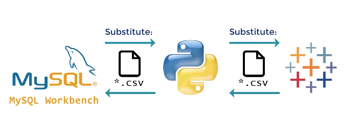

# absentieesm_prediction_BI_integration

Integrate 3 tools for BI data reporting- 
* Python: preprocessing and predict data results; 
* MySQL: secure predicated data queries &amp; storage; 
* Tableau: data story &amp; reports

Tableau Visuazliation Reports:

1. age vs probability
the older, people gets, the probability of being absent can be higer. However, mots of probabilty are lower than 50%, so the pattern of being absent due to age is not very obvious

2. transportation expense vs probability (# of Childre): 
It make sense that when travel expenses are becoming more and more expensive,  the chance the people being absent are getting higher and higher. With number of children’s filter involves, we case $240 is the cut off line in terms of transportation for people who has 1 or 2 children.

3. reasons vs probability: Qualitative vs Quantitative Analysis; The horizontal axis shows the probability of people being absent for each particular reason.
* Reason 2 can be dropped since none the people being absent due to reason 2, so it got dropped
* Reason1: Serious disease, the probability he or she will be absent is more than 50%.
* Reason3: the probability, did not show a strong sign of correlation of people being absent.
* Reason 4: light reasons (Weather, dental, blood donaton…), corresponded to people being absent lower than 50%.

Conclusion:
So we can say that people who are absent due to reason 4 category should not be absent in the fair reasonable way
